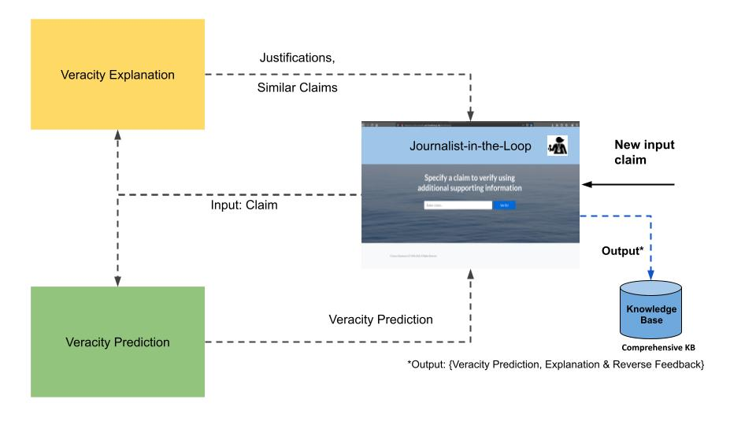
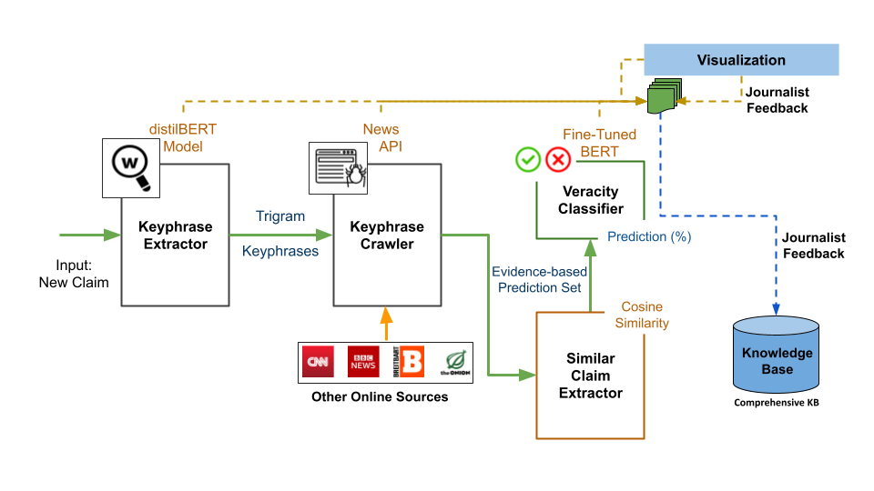
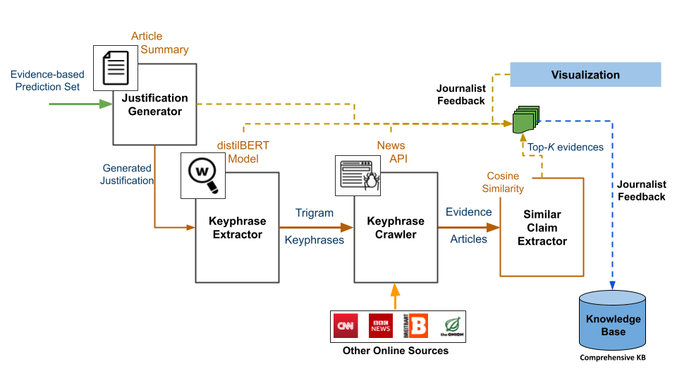
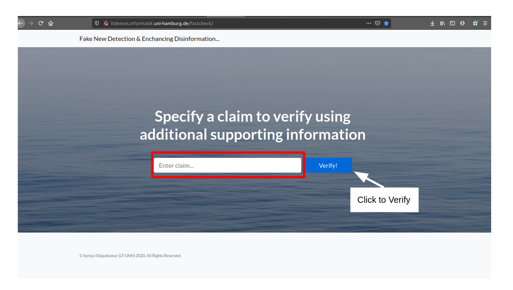

# Fake News Detection Framework with Journalist-in-the-Loop

This repository contains the code for the Fake News Detection Framework implemented as a part of my master thesis under M.Sc. in Intelligent Adaptive Systems. The framework is built and implemented to assist end-users/journalists in their fact-verification process. The thesis is present [here](https://www.inf.uni-hamburg.de/en/inst/ab/lt/teaching/theses/completed-theses/2021-ma-vijayakumar.pdf)

## Table of contents

* [Knowledge Base & Datasets](#knowledge-base-&-datasets)
* [Model Fine-Tuning](#model-fine-tuning)
* [Framework Implementation](#framework-implementation)
    * [Hardware Prerequisites](#hardware-prerequisites)
    * [Software Prerequisites](#software-prerequisites)
    * [Utils](#utils)
* [Using the Server](#using-the-server)
* [License](#license)


## Knowledge Base & Datasets

The knowledge base created as a part of this framework implementation, known as the Comprehensive Knowledge Base (CompKB),  can be found under the Datasets Folder. Currently, they are available [here](http://ltdata1.informatik.uni-hamburg.de/factverify/) and needs to be placed under the Datasets folder, as per the configurable path requirement in the notebooks.  

The following are the datasets used:
1. TrueFake Dataset
2. LIAR-PLUS Dataset
3. EUvsDisInfo Dataset

The Knowledge Base & Datasets notebook contains the code for creating the CompKB, datasets and its analysis. 


## Model Fine-Tuning

Three tranfomer models are fine-tuned using the above datasets and the respective notebooks are as below:

1. BERT Fine-Tuning (Veracity Classifier)
2. T5 Fine-Tuning and Evaluation (Justification Generator)
3. GPT-2 Fine-Tuning on [Google collab notebook](https://colab.research.google.com/drive/1c-cwTLzC30u5F4PfYT6jylpBC_zS_zEQ?usp=sharing). 

Note: The fine-tuned models are not available in this repository, please use the above notebooks to fine-tune them and add them to the 'TrainedModels' folder for using the framework. 

The datasets and trained models used in our framework is available in this [repository](http://ltdata1.informatik.uni-hamburg.de/factverify/) 


## Framework Implementation


### Hardware Prerequisites
The framework uses two fine-tuned transformer models, BERT and T5. They both are computationally heavy, hence require GPUs for running the server.

Depending on the GPU available, edit the lines in srvFakeNewsDetection.py

```
os.environ["CUDA_DEVICE_ORDER"]="PCI_BUS_ID"
os.environ["CUDA_VISIBLE_DEVICES"]="5" 

```

### Software Prerequisites

1. The server is a Flask-based server and can be run either on local host or using a public IP for external access. The current port number is set to '5001', which can be changed as required.

2. The library requirement are contained in the requirements.txt file. I suggest to create a python 3 virtual environment to avoid version related issues while installing the requirements. 

Note that, the code is built and tested using the library versions as per the requirements. To ensure the server is running without issues, these versions are mandatory. 

Run the following command to install requirements:

```
pip3 intall -r requirements.txt

```

3. The Spacy uses the English model and requires to be downloaded separately.

Run the following command to download it:

```
python3 -m spacy download en_core_web_lg

```

4. The NewsApi library requires APIKEY. Register with them to obtain the key and add it in Utils/WebCrawler.py

```
myKey = "key from newsapi" 

```

5. Fine-Tuned Models and Outputs

The fine-tuned models are to be placed under the 'TrainedModels' folder and the 'PipelineOutputs' must contain the output_X.X.X.X.tsv file. This file stores the module outputs and end-user feedback. Note that the IP is used to track the end-user (this is optional and can be replaced by adapting the server code)

6. Flask Server requirements

The templates and static folders contain the HTML5 templates and CSS content for rendering the Flask Server.


### Utils

The utils folder consists of the code corresponding to the modules implemented in the Veracity Prediction, Veracity Explanation and Journalists-in-the-Loop component of the framework. The JSON files contain the URLs of the online news sources that is used to crawl the web. The following figures illustrate the high-level and low-level architectures of the framework:

#### Fake News Detection Framework High-Level Architecture


#### Veracity Prediction Low-Level Architecture


#### Veracity Explanation Low-Level Architecture



## Using the Server

Once the above prerequites are met, the Flask server can be activated.

As an alternate way, run the following script for quick installation (make sure that the requirements are installed in a virtual environment to avoid version conflicts):

```
./quickinstall.sh
source activatevenv.sh
python3 -m spacy download en_core_web_lg

```


Run the following command to activate the server:
If on GPU:

```
CUDA_VISIBLE_DEVICES="X" python3 srvFakeNewsDetection.py

```

Replace X with the respective GPU device number.

If on CPU:

```
python3 srvFakeNewsDetection.py

```

The following should be the expected terminal outputs (for GPU):

<pre>Current Device ID is:0
Class Weights: [1.02800445 0.97348086]
 * Serving Flask app &quot;srvFakeNewsDetection&quot; (lazy loading)
 * Environment: production
<font color="#CC0000">   WARNING: This is a development server. Do not use it in a production deployment.</font>
<font color="#AAAAAA">   Use a production WSGI server instead.</font>
 * Debug mode: off
 * Running on http://0.0.0.0:5001/ (Press CTRL+C to quit)
</pre>

The following is the screenshot of the HTML5 client, when opened in a browser:



Currently, the live demo of our framework is available [here](http://ltdemos.informatik.uni-hamburg.de/factcheck/)


## License

This project is open source for everyone. 

